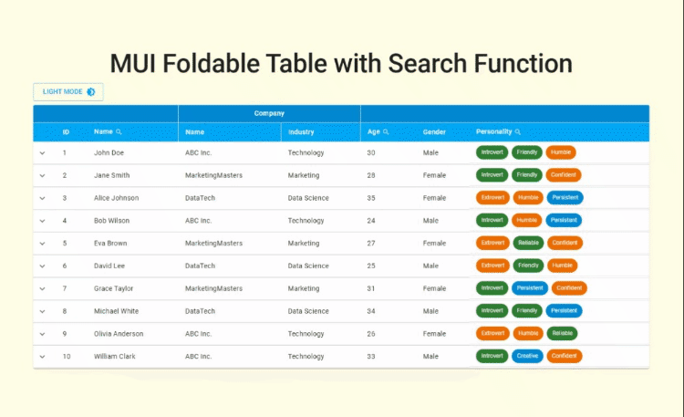
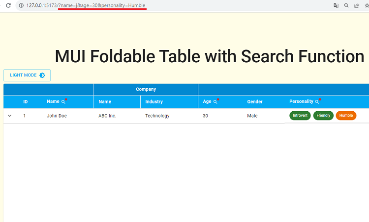

# MUI Foldable Table

When it comes to Table components, one of my favorite is the collapse table. Because it provides a choice for users to display concise data or more detailed data. After I found out collapse table is not a packed item but still can be build with plain table component, I just couldn't wait to make one.

## Feature

- Foldable (Collapse) Rows - Let users choose between concise and detailed data
- Text Search - For Name column, users can type in plain text to search for matching data
- Slider Search - For Age column, users can slide to particular age range for matching data
- MultiTag Search - For Personality column, users can select multiple tags for matching data
- Search State Management in url - Since the search parameters are stored in the url, the UI state could be preserved even after reload.
- Dark Mode - Switing website background and text color with the help of MUI ThemeProvider

| Tools & Skills   | Purpose                                                                    |
| ---------------- | -------------------------------------------------------------------------- |
| MUI              | Using Table component to build custom Table and Dark Mode palette settings |
| React Context    | Context for search parameter management and Dark Mode switching            |
| React Router Dom | Obtain url search parameters with useSearchParam Hook                      |

## Demo

### Foldable Rows

### Text Search

### Slider Search

### MultiTag Search

### Search State Management in url

### Dark Mode

